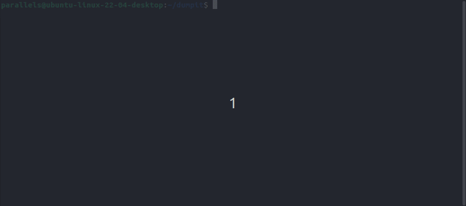
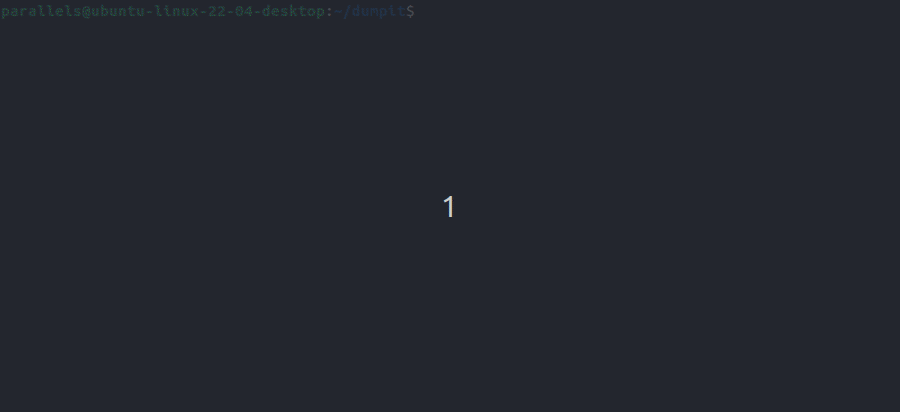
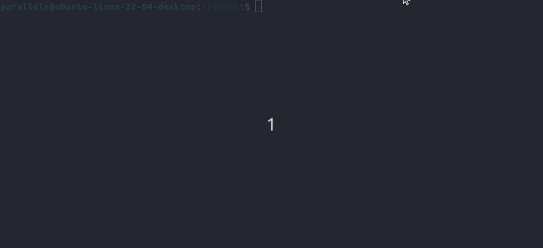

# DumpItForLinux

# Getting Started
`dumpit-linux` (or `DumpItForLinux`) is very straight forward - the only thing you need is root permission as it relies on /proc/kcore to create a compact version, and is compatible with the old and new versions of `/proc/kcore`.

Following the same philosophy as DumpIt for Windows which relies on the Microsoft Crash Dump format and is fully compatible with WinDbg, DumpItForLinux relies on the Linux ELF Core format and is fully compatible with `gdb`,  `crash`, and `drgn`.

In short, why you should use this utility:
- Interoperability. The generated output file is compatible with popular Linux debugging and troubleshooting tools and frameworks: `gdb`, `crash`, and `drgn`.
- Open file formats. The output file does not rely on a new file format, it creates a Linux ELF CORE file which is the reason it is interoperable with the above tools. And, the utility leverages an existing compression archive format (`.tar.zst`) which relies on the super-fast [zstandard compression algorithm](http://facebook.github.io/zstd/).
- Rust. This utility has been written in Rust, meaning that it is not only memory-safe - it can later be expanded to support additional remote streaming options.
- User-land. This utility relies on `/proc/kcore` meaning that no Linux kernel module is required. Root permission is, however, needed.

## Building
1. [Install Rust](https://www.rust-lang.org/tools/install)
2. Run the following command
```
cargo build --release
```
`cargo build --release` puts the resulting binary in `target/release` instead of `target/debug`.

Compiling in debug mode is the default for development-- compilation time is shorter since the compiler doesn't do optimizations, but the code will run slower. Release mode takes longer to compile, but the code will run faster.

## What are Kernel crash dumps?
More information can be found on the [Ubuntu Documentation](https://ubuntu.com/server/docs/kernel-crash-dump).

## Usage
### CLI Usage
```
DumpIt (For Linux - x64 & ARM64) v0.1.0-8-gbcbb4e8 (2022-10-09T04:48:11Z)
Linux memory acquisition that makes sense.
Copyright (c) 2022, Magnet Forensics, Inc.

A program that makes memory analysis for incident response easy, scalable and practical

Usage: dumpitforlinux [OPTIONS] [Output Path]

Arguments:
  [Output Path]  Path to the output archive or file

Options:
  -0, --to-stdout  Write to stdout instead of a file
  -r, --raw        Create a single core dump file instead of a compressed archive
  -v, --verbose    Print extra output while parsing
  -h, --help       Print help information
  -V, --version    Print version information
```
### Generate a tar.zst with the default generated name
```
sudo dumpitforlinux 
```

### Decompression
```
tar -I zstd -xvf <filename>.tar.zst
```

## Troubleshooting
### Installing debugging symbols
#### Ubuntu
[Learn more about Ubuntu Debug Symbol Packages](https://wiki.ubuntu.com/Debug%20Symbol%20Packages)

```
echo "deb http://ddebs.ubuntu.com $(lsb_release -cs) main restricted universe multiverse
deb http://ddebs.ubuntu.com $(lsb_release -cs)-updates main restricted universe multiverse
deb http://ddebs.ubuntu.com $(lsb_release -cs)-proposed main restricted universe multiverse" | \
sudo tee -a /etc/apt/sources.list.d/ddebs.list

sudo apt-get update

sudo apt-get install linux-image-`uname -r`-dbgsym
```
### Testing with crash
`crash` is a very useful utility for troubleshooting and testing kernel crash dumps.

[Learn more about crash](https://manpages.ubuntu.com/manpages/bionic/man8/crash.8.html)

```
sudo apt install crash
sudo apt-get install linux-image-`uname -r`-dbgsym
crash <path to dump> /usr/lib/debug/boot/vmlinux-`uname -r`
```

#### Running crash


<details>
  <summary>Expand</summary>

```
$ crash kcore.dumpit.5.15.0-48-generic.2022-10-09-0039.core /usr/lib/debug/boot/vmlinux-5.15.0-48-generic 

crash 8.0.0
Copyright (C) 2002-2021  Red Hat, Inc.
Copyright (C) 2004, 2005, 2006, 2010  IBM Corporation
Copyright (C) 1999-2006  Hewlett-Packard Co
Copyright (C) 2005, 2006, 2011, 2012  Fujitsu Limited
Copyright (C) 2006, 2007  VA Linux Systems Japan K.K.
Copyright (C) 2005, 2011, 2020-2021  NEC Corporation
Copyright (C) 1999, 2002, 2007  Silicon Graphics, Inc.
Copyright (C) 1999, 2000, 2001, 2002  Mission Critical Linux, Inc.
Copyright (C) 2015, 2021  VMware, Inc.
This program is free software, covered by the GNU General Public License,
and you are welcome to change it and/or distribute copies of it under
certain conditions.  Enter "help copying" to see the conditions.
This program has absolutely no warranty.  Enter "help warranty" for details.
 
GNU gdb (GDB) 10.2
Copyright (C) 2021 Free Software Foundation, Inc.
License GPLv3+: GNU GPL version 3 or later <http://gnu.org/licenses/gpl.html>
This is free software: you are free to change and redistribute it.
There is NO WARRANTY, to the extent permitted by law.
Type "show copying" and "show warranty" for details.
This GDB was configured as "aarch64-unknown-linux-gnu".
Type "show configuration" for configuration details.
Find the GDB manual and other documentation resources online at:
    <http://www.gnu.org/software/gdb/documentation/>.

For help, type "help".
Type "apropos word" to search for commands related to "word"...

WARNING: cpu 0: cannot find NT_PRSTATUS note    
WARNING: cpu 1: cannot find NT_PRSTATUS note
please wait... (determining panic task)       
WARNING: cannot determine starting stack frame for task ffff80000a9488c0

WARNING: cannot determine starting stack frame for task ffff00000cc93f00
      KERNEL: /usr/lib/debug/boot/vmlinux-5.15.0-48-generic  [TAINTED]
    DUMPFILE: kcore.dumpit.5.15.0-48-generic.2022-10-09-0039.core
        CPUS: 2
        DATE: Sat Oct  8 17:39:28 PDT 2022
      UPTIME: 4 days, 14:22:02
LOAD AVERAGE: 0.28, 0.44, 0.51
       TASKS: 464
    NODENAME: ubuntu-linux-22-04-desktop
     RELEASE: 5.15.0-48-generic
     VERSION: #54-Ubuntu SMP Fri Aug 26 13:31:33 UTC 2022
     MACHINE: aarch64  (unknown Mhz)
      MEMORY: 2 GB
       PANIC: ""
         PID: 0
     COMMAND: "swapper/0"
        TASK: ffff80000a9488c0  (1 of 2)  [THREAD_INFO: ffff80000a9488c0]
         CPU: 0
       STATE: TASK_RUNNING (ACTIVE)
     WARNING: panic task not found

crash> ps
   PID    PPID  CPU       TASK        ST  %MEM     VSZ    RSS  COMM
>     0      0   0  ffff80000a9488c0  RU   0.0       0      0  [swapper/0]
      0      0   1  ffff0000002e3f00  RU   0.0       0      0  [swapper/1]
      1      0   0  ffff00000024ee40  IN   0.3  168440   8700  systemd
      2      0   1  ffff000000248fc0  IN   0.0       0      0  [kthreadd]
      3      2   0  ffff00000024de80  ID   0.0       0      0  [rcu_gp]
      4      2   0  ffff000000248000  ID   0.0       0      0  [rcu_par_gp]
      5      2   0  ffff00000024bf00  ID   0.0       0      0  [netns]
      7      2   0  ffff00000024cec0  ID   0.0       0      0  [kworker/0:0H]
      9      2   0  ffff000000259f80  ID   0.0       0      0  [mm_percpu_wq]
     10      2   0  ffff00000025ee40  IN   0.0       0      0  [rcu_tasks_rude_]
     11      2   0  ffff000000258fc0  IN   0.0       0      0  [rcu_tasks_trace]
     12      2   0  ffff00000025de80  IN   0.0       0      0  [ksoftirqd/0]
     13      2   0  ffff000000258000  ID   0.0       0      0  [rcu_sched]
     14      2   0  ffff00000025bf00  IN   0.0       0      0  [migration/0]
     15      2   0  ffff00000025af40  IN   0.0       0      0  [idle_inject/0]
     17      2   0  ffff0000002e2f40  IN   0.0       0      0  [cpuhp/0]
     18      2   1  ffff0000002e4ec0  IN   0.0       0      0  [cpuhp/1]
     19      2   1  ffff0000002e1f80  IN   0.0       0      0  [idle_inject/1]
     20      2   1  ffff0000002e6e40  IN   0.0       0      0  [migration/1]
(...)
```

</details>

### Testing with drgn
You can load a memory image generated by `dumpit-linux` into `drgn` too. 

Refer to the official page, to find out [how to install drgn](https://github.com/osandov/drgn#installation).

```
sudo pip3 install drgn
drgn -c <path to dump>
```

#### Running drgn


<details>
  <summary>Expand</summary>

```
$ drgn -c kcore.dumpit.5.15.0-48-generic.2022-10-09-0039.core 
drgn 0.0.20 (using Python 3.10.6, elfutils 0.186, without libkdumpfile)
For help, type help(drgn).
>>> import drgn
>>> from drgn import NULL, Object, cast, container_of, execscript, offsetof, reinterpret, sizeof
>>> from drgn.helpers.linux import *
>>> from drgn.helpers.linux import list_for_each_entry
>>> for mod in list_for_each_entry('struct module', prog['modules'].address_of_(), 'list'):
...     print(mod.name)
... 
(char [56])"usblp"
(char [56])"prl_fs_freeze"
(char [56])"prl_fs"
(char [56])"snd_hda_codec_generic"
(char [56])"ledtrig_audio"
(char [56])"snd_hda_intel"
(char [56])"snd_intel_dspcfg"
(...)
```

</details>

# Contributing / Feedback
If you encounter any bugs, please file an issue in the [issues](https://github.com/magnetforensics/dumpit-linux) section of the project.
